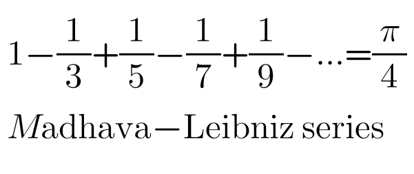

# Computing Pi Approximation
## Computing Pi Approximation with Leibniz Series in C
   
   
Pi=(1/1 - 1/3 + 1/5 - ... n)*4
   
Let's take i= 1 to n
- if (i%2 == 0) {do subtraction operation}
- else          {do addition operation}
   
   
```
   for(int i=1; i <= n; i++){
        if(i%2 == 0){
            pi=pi-1.0/(i*2-1);
        }else{
            pi=pi+1.0/(i*2-1);
        }
```


why pi=pi +or- 1.0/(i*2-1)
Pi=(1/1 - 1/3 + 1/5 - ... n)*4
   i =  1     2      3       ...  n    
   
